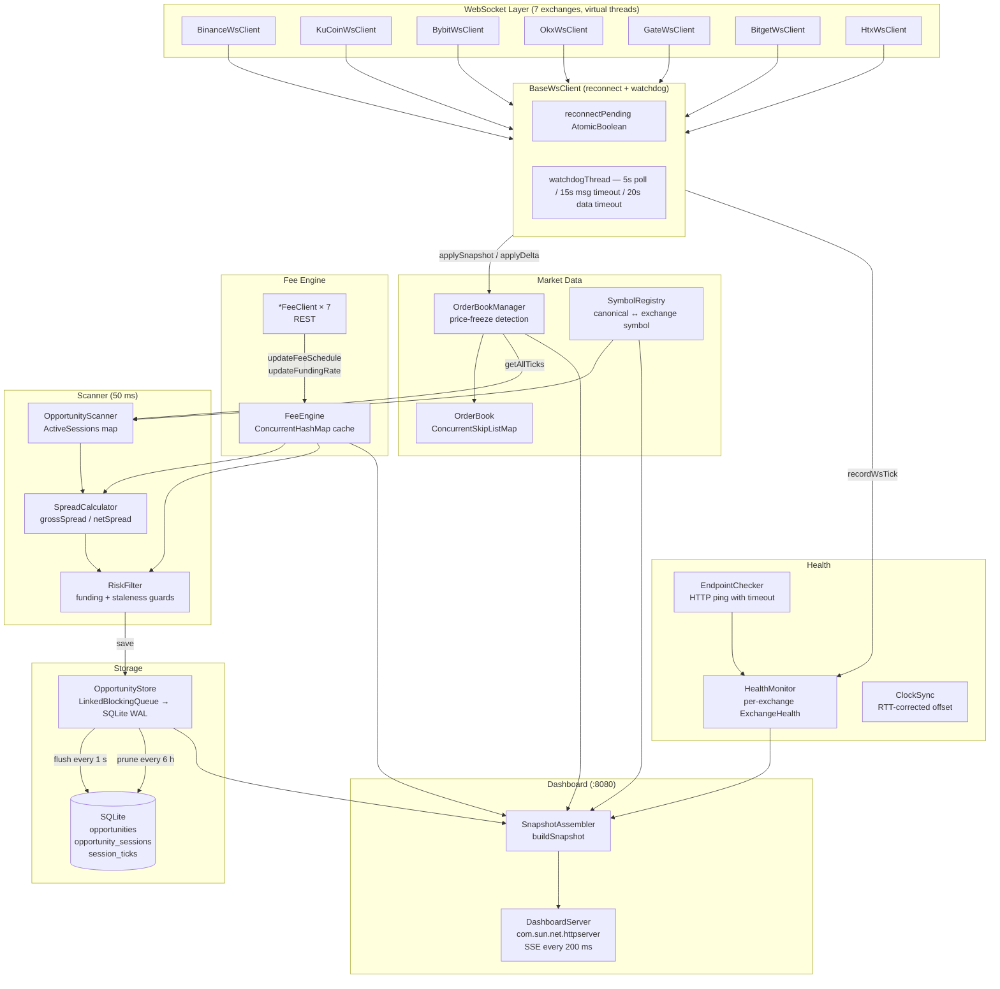

# arb-bot — Cross-Exchange Futures Arbitrage Scanner

**Phase 1 — Detection only. No order placement.**

arb-bot watches the USDT-margined perpetual futures order books of **7 exchanges** (Binance, KuCoin, Bybit, OKX, Gate.io, Bitget, HTX) simultaneously. Every 50 ms it computes depth-adjusted VWAP prices for **50 canonical symbols** across all enabled exchanges, subtracts round-trip taker fees and estimated funding costs, and logs every directional pair whose net spread exceeds a configurable threshold. Results are stored in a local SQLite database and displayed on a live web dashboard at `http://localhost:8080/`.

The bot does **not** place orders. `Exchange.placeOrder()` is a stub that throws `UnsupportedOperationException`. Phase 2 (execution engine) is designed but not implemented.

---

## 📋 Table of Contents

1. [Quick Start](#-quick-start)
2. [How to Run](#-how-to-run)
3. [Architecture](#-architecture)
4. [Configuration Reference](#-configuration-reference)
5. [Exchange Integrations](#-exchange-integrations)
6. [Database](#-database)
7. [Terminal Output Explained](#-terminal-output-explained)
8. [Metrics](#-metrics)
9. [What to Watch Out For](#-what-to-watch-out-for)
10. [Phase 2 Preview](#-phase-2-preview)
11. [Development](#-development)
12. [Troubleshooting](#-troubleshooting)
13. [Appendix](#-appendix)

---

## 🚀 Quick Start

### Prerequisites

- Java 21+ (`java -version` must show `21` or higher)
- Gradle wrapper included — no separate Gradle install needed

### From zero to running in 5 steps

```bash
# 1. Clone and enter
git clone <repo-url> && cd arb-bot

# 2. (Optional) Set API keys for accurate fee schedules — bot runs without them
export BINANCE_API_KEY=xxx  BINANCE_API_SECRET=xxx
export BYBIT_API_KEY=xxx    BYBIT_API_SECRET=xxx
export OKX_API_KEY=xxx      OKX_API_SECRET=xxx  OKX_API_PASSPHRASE=xxx
export KUCOIN_API_KEY=xxx   KUCOIN_API_SECRET=xxx  KUCOIN_API_PASSPHRASE=xxx

# 3. Build
./gradlew build -x test

# 4. Run
./gradlew run

# 5. Verify — within 30 seconds you should see in logs/arbbot.log:
#   [binance] Snapshot applied for BTCUSDT, lastUpdateId=...
#   [kucoin]  Snapshot applied for XBTUSDTM, seq=...
#   [bybit]   Snapshot applied for BTCUSDT, seq=...
#   [okx]     Snapshot applied for BTC-USDT-SWAP, seqId=...
#   [gate]    Gate WS initialized for BTC_USDT
#   [bitget]  Snapshot applied for BTCUSDT
#   [htx]     Snapshot applied for BTC-USDT, version=...
# Then open http://localhost:8080/ in a browser
```

> 📝 Without API keys the bot runs in public-data-only mode. Fee schedules fall back to conservative defaults. Funding rates are always public.

---

## ⚙️ How to Run

### Option 1: `./gradlew run` — quick terminal launch

```bash
cd arb-bot
./gradlew run
```

With path overrides (so logs and DB go to fixed locations regardless of working directory):
```bash
./gradlew run \
  -Darbbot.log.dir=/absolute/path/arb-bot/logs \
  -Darbbot.storage.dbPath=/absolute/path/arb-bot/data/opportunities.db
```

**IntelliJ setup** (Gradle toolbar → right-click `run` → Modify Run Configuration):
- **VM options**: `-Darbbot.log.dir=/absolute/path/arb-bot/logs -Darbbot.storage.dbPath=/absolute/path/arb-bot/data/opportunities.db`

---

### Option 2: IntelliJ Application run config — recommended for development

**IntelliJ setup** (Run → Edit Configurations → `+` → Application):

| Field | Value |
|---|---|
| **Name** | Arb Bot |
| **Main class** | `com.arbbot.Main` |
| **Module** | `arb-bot.main` |
| **VM options** | `--enable-preview -Darbbot.log.dir=/absolute/path/arb-bot/logs -Darbbot.storage.dbPath=/absolute/path/arb-bot/data/opportunities.db` |
| **Working directory** | `/absolute/path/arb-bot` |
| **Environment variables** | `BINANCE_API_KEY=xxx;BINANCE_API_SECRET=xxx;...` |

---

### Option 3: Fat JAR — run without IntelliJ or Gradle

```bash
./gradlew shadowJar
java --enable-preview \
  -Darbbot.log.dir=/absolute/path/arb-bot/logs \
  -Darbbot.storage.dbPath=/absolute/path/arb-bot/data/opportunities.db \
  -jar build/libs/arb-bot.jar
```

---

### JVM system properties

| Property | Controls | Default (if not set) |
|---|---|---|
| `-Darbbot.log.dir` | Directory for `arbbot.log` and rotated `.gz` files | `logs/` relative to working directory |
| `-Darbbot.storage.dbPath` | Full path to the SQLite database file | `data/opportunities.db` relative to working directory |

### Environment variables

| Variable | Exchange | Effect if absent |
|---|---|---|
| `BINANCE_API_KEY` / `BINANCE_API_SECRET` | Binance | Fee schedule falls back to default taker 0.05% |
| `KUCOIN_API_KEY` / `KUCOIN_API_SECRET` / `KUCOIN_API_PASSPHRASE` | KuCoin | No current effect — fees fetched from public endpoint |
| `BYBIT_API_KEY` / `BYBIT_API_SECRET` | Bybit | Fee schedule falls back to default taker 0.06% |
| `OKX_API_KEY` / `OKX_API_SECRET` / `OKX_API_PASSPHRASE` | OKX | Fee schedule falls back to default taker 0.05% |
| `HTX_API_KEY` / `HTX_API_SECRET` | HTX | Fee schedule falls back to default taker 0.04% |

Gate.io and Bitget fee schedules are fetched from public endpoints — no keys required.

### Stopping cleanly

Use `Ctrl+C` or `kill <pid>` — both trigger the JVM shutdown hook. The hook:
1. Stops the SSE pusher and HTTP server
2. Shuts down the scan and health schedulers
3. Disconnects all WS clients
4. Logs final stats (total sessions, max net spread)
5. Calls `OpportunityStore.close()` — flushes pending buffer to SQLite and closes the connection

> ⚠️ **Force-kill (`kill -9`) skips the shutdown hook**. Any buffered data not yet flushed will be lost. SQLite itself will not be corrupted.

---

## 🏗 Architecture

### Component diagram



### Data flow: raw WebSocket frame → logged opportunity

| Step | Where | What happens |
|---|---|---|
| 1 | `BaseWsClient.onMessage()` | `lastMessageAt.set(now)` — resets watchdog clock |
| 2 | `*WsClient.handleMessage()` | Parse JSON / decompress GZIP (HTX) |
| 3a | Binance | Buffer deltas until REST snapshot arrives; apply buffered deltas after snapshot |
| 3b | Bybit / HTX | `type=snapshot` → `book.applySnapshot()`; delta → `book.applyDelta()` |
| 3c | Gate.io | Delta-accumulation: buffer bids+asks until both non-empty → `book.applySnapshot()` to bootstrap; subsequent deltas applied directly |
| 3d | OKX / Bitget | `action=snapshot` → `book.applySnapshot()`; `action=update` → `book.applyDelta()` |
| 3e | KuCoin | REST snapshot + pipe-delimited delta format |
| 4 | `recordDataReceived()` | Updates `lastDataAt` — distinct from heartbeat-only messages |
| 5 | `OpportunityScanner.scan()` every 50 ms | For each of 50 symbols × up to 7 exchanges |
| 6 | `OrderBookManager.getAllTicks()` | Check `isInitialized()`, `!isStale()`, `!isBestBidFrozen(120s)` |
| 7 | `SpreadCalculator.grossSpread(buyTick, sellTick)` | `(effectiveSell − effectiveBuy) / effectiveBuy` |
| 8 | Sanity cap | Skip if `gross > maxGrossSpreadPercent / 100` (default 3%) |
| 9 | `SpreadCalculator.netSpread()` | `gross − feeEngine.getTotalRoundTripCost(...)` |
| 10 | Threshold check | Skip if `net < minNetSpreadPercent / 100` (default 0.05%) |
| 11 | `RiskFilter.passes()` | Rejects if: either tick unreliable, `abs(fundingRate) > 0.1%`, settlement within 5 min |
| 12 | `ActiveSession` update | Lifetime stats updated on every qualifying tick |
| 13 | Debounced DB write | `store.save(opp)` only if net% changed ≥ 0.01% OR 30 s elapsed since last write |
| 14 | Session close | After 10 consecutive missing ticks (~500 ms gap): `store.saveSession()` + `store.saveSessionTicks()` (only for sessions ≥ 60 s) |

### Latency budget

| Component | Configured value | Notes |
|---|---|---|
| WS depth update frequency | 100 ms (Binance), ~100 ms others | Exchange-side push rate |
| Scanner interval | `scanIntervalMs = 50` ms | Fixed-rate virtual thread scheduler |
| WS stale threshold | `wsStaleThresholdMs = 2000` ms | Feed marked unreliable if no message |
| Price freeze threshold | 120 s | Best bid unchanged: excluded from scanner |
| Watchdog: no message | 15 000 ms | Force-reconnect if socket silently dies |
| Watchdog: no book data | 20 000 ms | Force-reconnect if heartbeats come but no depth data |
| DB flush | `flushIntervalMs = 1000` ms | Batch INSERT |
| DB prune | every 6 h | DELETE rows older than retention window |
| SSE push | 200 ms | Dashboard update rate |

---

## 🔧 Configuration Reference

All keys live under the `arbbot` prefix in `src/main/resources/application.conf`.

### `arbbot.exchanges.<name>`

| Key | Type | Default | Effect |
|---|---|---|---|
| `enabled` | boolean | `true` | If `false`, exchange skipped entirely |
| `restBaseUrl` | string | (per exchange) | Base URL for REST calls |
| `wsBaseUrl` | string | (per exchange) | WebSocket URL |
| `apiKey` | string? | `${?ENV_VAR}` | From environment |
| `apiSecret` | string? | `${?ENV_VAR}` | From environment |
| `apiPassphrase` | string? | `${?ENV_VAR}` | OKX and KuCoin only |

### `arbbot.scanner`

| Key | Type | Default | Effect |
|---|---|---|---|
| `minNetSpreadPercent` | double | `0.05` | Minimum net spread (after fees + funding) to open a session |
| `maxGrossSpreadPercent` | double | `3.0` | Sanity cap — skip if gross spread exceeds this |
| `orderSizeUsdt` | double | `1000` | Notional for VWAP depth calculation |
| `scanIntervalMs` | long | `50` | How often `OpportunityScanner.scan()` runs in ms |
| `symbols` | list | 50 symbols | BTC ETH SOL BNB XRP DOGE LINK AVAX ADA DOT LTC TRX SUI APT NEAR TON UNI ATOM HBAR OP AAVE ALGO ARB AXS BCH CRV DYDX ENA ETC FIL GRT ICP INJ JUP LDO ONDO ORDI PENDLE POL PYTH SAND SEI TAO TIA VIRTUAL W WIF WLD XLM ZK |

### `arbbot.risk`

| Key | Type | Default | Effect |
|---|---|---|---|
| `maxFundingRatePercent` | double | `0.1` | Reject if `abs(fundingRate) > 0.1%` on either leg |
| `minFundingTimeBufferMinutes` | long | `5` | Reject if funding settles within this many minutes |

### `arbbot.health`

| Key | Type | Default | Effect |
|---|---|---|---|
| `checkIntervalSeconds` | long | `30` | How often health staleness is checked |
| `wsStaleThresholdMs` | long | `2000` | Feed marked stale if no WS message in this many ms |
| `endpointTimeoutMs` | long | `5000` | REST health check timeout at startup |

### `arbbot.storage`

| Key | Type | Default | Effect |
|---|---|---|---|
| `dbPath` | string | `data/opportunities.db` | SQLite file path |
| `flushIntervalMs` | long | `1000` | How often the write buffer is drained to SQLite |

### `arbbot.dashboard`

| Key | Type | Default | Effect |
|---|---|---|---|
| `enabled` | boolean | `true` | Set to `false` to disable the HTTP server |
| `port` | int | `8080` | Port for dashboard and SSE stream |

---

## 🔌 Exchange Integrations

### Binance Futures

| Property | Value |
|---|---|
| REST base | `https://fapi.binance.com` |
| WS URL | `wss://fstream.binance.com/stream?streams=<sym>@depth@100ms/...` (all 50 symbols combined) |
| Depth stream | Combined multi-stream: incremental 100 ms updates |
| Snapshot endpoint | `GET /fapi/v1/depth?symbol=BTCUSDT&limit=100` |
| Sequence mode | `seqNum=-1` (absolute quantities; gaps cause only transient staleness) |
| Default taker fee | `0.0005` (0.05%) |
| Symbol format | `BTCUSDT` — perpetual USDT-margined only |

**Known quirks:**
- Combined stream endpoint does **not** accept application-level JSON messages. Sending `{"method":"ping"}` triggers close code `1008`. Never call `schedulePing()` on Binance.
- Binance closes all WS connections after 24 hours. The watchdog handles forced reconnects.
- Occasionally, specific symbols' depth updates may pause for 1–2 minutes while heartbeats continue flowing (Binance server-side). The price-freeze detector (120 s best-bid unchanged) catches this and excludes affected symbols from scanning until they recover.

### KuCoin Futures

| Property | Value |
|---|---|
| REST base | `https://api-futures.kucoin.com` |
| WS URL | Dynamic: `POST /api/v1/bullet-public` returns token. URL: `{endpoint}?token={token}&connectId={uuid}` |
| Depth topic | `/contractMarket/level2:{symbol}` |
| Delta format | `data.change`: pipe-delimited `price,side,qty` entries |
| Heartbeat | Send `{"id":"...", "type":"ping"}` every `pingInterval` ms (~18 000 ms) |
| Default taker fee | `0.0006` (0.06%) |
| Symbol format | `XBTUSDTM` for BTC (KuCoin legacy ticker). `SymbolRegistry` maps `XBT → BTC` |

**Known quirks:**
- `nextSettlement` for KuCoin funding rate is unavailable — set to `Instant.MAX`, displayed as `—` in dashboard.

### Bybit

| Property | Value |
|---|---|
| REST base | `https://api.bybit.com` |
| WS URL | `wss://stream.bybit.com/v5/public/linear` (5 shards, ~10 symbols each) |
| Subscribe | `{"op":"subscribe","args":["orderbook.50.BTCUSDT"]}` |
| Heartbeat | Send `{"op":"ping"}` every 20 000 ms |
| Default taker fee | `0.0006` (0.06%) |
| Symbol format | `BTCUSDT` — only `contractType=LinearPerpetual` |

### OKX

| Property | Value |
|---|---|
| REST base | `https://www.okx.com` |
| WS URL | `wss://ws.okx.com:8443/ws/v5/public` |
| Subscribe | `{"op":"subscribe","args":[{"channel":"books","instId":"BTC-USDT-SWAP"}]}` |
| Heartbeat | Send plain string `"ping"` every 25 000 ms |
| Default taker fee | `0.0005` (0.05%) |
| Symbol format | `BTC-USDT-SWAP` — only `instType=SWAP` and `ctType=linear` |

### Gate.io Futures

| Property | Value |
|---|---|
| REST base | `https://api.gateio.ws` |
| WS URL | `wss://fx-ws.gateio.ws/v4/ws/usdt` |
| Channel | `futures.order_book_update` — delta-only (no snapshot message) |
| Delta fields | `result.s` (symbol), `result.b` (bids), `result.a` (asks); level format `{"p":"price","s":qty}` |
| Initialization | Accumulate deltas until both bids and asks non-empty → `applySnapshot()` to bootstrap |
| Default taker fee | `0.0005` (0.05%) |
| Symbol format | `BTC_USDT` |
| Clock offset | May exceed 500 ms warning (high network RTT to Asia servers) — Phase 2 concern only |

### Bitget Futures

| Property | Value |
|---|---|
| REST base | `https://api.bitget.com` |
| WS URL | `wss://ws.bitget.com/v2/ws/public` |
| Subscribe | `{"op":"subscribe","args":[{"instType":"USDT-FUTURES","channel":"books","instId":"BTCUSDT"}]}` |
| Default taker fee | `0.0006` (0.06%) |
| Symbol format | `BTCUSDT` — product type `USDT-FUTURES` |

### HTX (Huobi) Futures

| Property | Value |
|---|---|
| REST base | `https://api.hbdm.com` |
| WS URL | `wss://api.hbdm.com/linear-swap-ws` (2 shards, ~25 symbols each) |
| Protocol | All frames GZIP-compressed binary; handled in `handleBinaryMessage()` |
| Heartbeat | Server sends `{"op":"ping","ts":...}`; must respond `{"op":"pong","ts":...}` |
| Time endpoint | `GET /api/v1/timestamp` → `{"status":"ok","ts":...}` (field: `ts`) |
| Default taker fee | `0.0004` (0.04%) |
| Symbol format | `BTC-USDT` |

**Known quirks:**
- ALL frames are GZIP binary — the `onMessage(String)` handler is never called for HTX.
- `lastMessageAt` must be updated in `onMessage(ByteString)` (not just `onMessage(String)`) to prevent false watchdog reconnects.
- Some lower-volume symbols (ZK, ARB, DOT, TIA, APT) may trigger the 120 s price-freeze warning periodically during low-liquidity hours. This is expected and handled correctly.

### WebSocket self-healing (all exchanges)

`BaseWsClient` implements two independent reconnect paths:

1. **Server-initiated close** (`onClosing` / `onClosed`): exponential backoff (100 ms → 200 ms → ... → 30 s cap).

2. **Silent death watchdog**: Virtual thread checks every 5 s:
   - No message at all in 15 s → force reconnect
   - Connected + heartbeats flowing, but no depth data in 20 s → force reconnect

`onBeforeReconnect()` clears all per-symbol buffering state so the new session starts clean.

---

## 💾 Database

Location: `data/opportunities.db` (default). Created automatically on first run. Uses SQLite WAL mode for better concurrent reads from the dashboard.

### Schema

#### `opportunities` table

One row per debounced scan tick that exceeded the threshold. Written at most once per 30 seconds per active `(symbol, longExchange, shortExchange)` triple.

| Column | Type | Description |
|---|---|---|
| `id` | TEXT PK | UUID v4 |
| `canonical_symbol` | TEXT | Base ticker: `BTC`, `ETH`, etc. |
| `long_exchange` | TEXT | Exchange where the bot would buy |
| `long_ask_price` | REAL | VWAP effective ask at `orderSizeUsdt` |
| `long_best_bid` | REAL | Raw best bid on long exchange |
| `short_exchange` | TEXT | Exchange where the bot would sell |
| `short_bid_price` | REAL | VWAP effective bid at `orderSizeUsdt` |
| `short_best_ask` | REAL | Raw best ask on short exchange |
| `gross_spread_pct` | REAL | `(shortBid − longAsk) / longAsk × 100` — in **percent** (e.g. 0.37 = 0.37%) |
| `net_spread_pct` | REAL | `grossSpread − totalRoundTripCost` — in **percent** |
| `estimated_cost_pct` | REAL | Round-trip cost in percent |
| `long_funding_rate` | REAL | Current funding rate on long exchange |
| `short_funding_rate` | REAL | Current funding rate on short exchange |
| `order_size_usdt` | REAL | Notional used for depth calculation |
| `max_volume_usdt` | REAL | Max USDT volume at which net spread remains positive |
| `long_ask_depth_usdt` | REAL | Available ask-side liquidity (top 10 levels) |
| `short_bid_depth_usdt` | REAL | Available bid-side liquidity (top 10 levels) |
| `detected_at` | TEXT | ISO-8601 timestamp |

**Retention:** rows older than 48 hours are deleted automatically every 6 hours.

#### `opportunity_sessions` table

One row per continuous window where a `(symbol, longExchange, shortExchange)` triple remained above `minNetSpreadPercent`. Closes after 10 consecutive missing scans (~500 ms gap).

| Column | Type | Description |
|---|---|---|
| `id` | TEXT PK | UUID assigned when session opens |
| `canonical_symbol` | TEXT | Base ticker |
| `long_exchange` | TEXT | Long leg exchange |
| `short_exchange` | TEXT | Short leg exchange |
| `started_at` | TEXT | ISO-8601 when first qualifying tick was seen |
| `ended_at` | TEXT | ISO-8601 when session closed |
| `peak_net_pct` | REAL | Maximum net spread in **percent** (e.g. 0.37 = 0.37%) |
| `avg_net_pct` | REAL | Mean net spread across all ticks |
| `min_net_pct` | REAL | Minimum net spread seen |
| `entry_net_pct` | REAL | Net spread at session open |
| `exit_net_pct` | REAL | Net spread at session close |
| `peak_volume_usdt` | REAL | Maximum `maxVolumeUsdt` seen during session |
| `avg_volume_usdt` | REAL | Mean `maxVolumeUsdt` |
| `duration_ms` | INTEGER | `ended_at − started_at` in milliseconds |
| `tick_count` | INTEGER | Number of 50 ms scan ticks where this triple qualified |

#### `session_ticks` table

Time-series snapshots within each session, recorded at most once per second (debounced). Only saved for sessions lasting ≥ 60 seconds to keep storage bounded.

| Column | Type | Description |
|---|---|---|
| `session_id` | TEXT PK | References `opportunity_sessions.id` |
| `seq` | INTEGER PK | 0-based sequence within session |
| `recorded_at` | TEXT | ISO-8601 timestamp |
| `net_pct` | REAL | Net spread at this tick (percent) |
| `gross_pct` | REAL | Gross spread at this tick (percent) |
| `max_volume_usdt` | REAL | Max profitable volume at this tick |
| `long_ask` | REAL | Effective ask price on long exchange |
| `short_bid` | REAL | Effective bid price on short exchange |

**Retention:** rows older than 7 days are deleted automatically every 6 hours.

### Data growth estimates

With 50 symbols across 7 exchanges (~90 active pairs at any moment) and 30 s debounce on opportunity writes:

| Table | Rate | Steady-state size |
|---|---|---|
| `opportunities` | ~180 rows/min → ~260K/day | ~13K rows at 48h retention |
| `opportunity_sessions` | ~400 sessions/hour → ~10K/day | grows unbounded (small rows) |
| `session_ticks` | only for sessions ≥ 60 s; rare | bounded by 7-day retention |

Typical DB size: **5–15 MB** in steady state (with WAL overhead).

> **Observed during a 30-minute test run**: 80MB was seen on an initial run *before* the 48h pruning and 30s debounce were applied. With the current settings, this drops to ~2–5MB per 30 minutes.

### Useful queries

```sql
-- All-time summary (sessions table)
SELECT COUNT(*) AS total_sessions,
       MAX(peak_net_pct) || '%' AS best_peak,
       AVG(avg_net_pct) || '%' AS avg_net,
       MIN(started_at) AS first_seen,
       MAX(ended_at) AS last_seen
FROM opportunity_sessions;

-- Best peak spread per symbol
SELECT canonical_symbol,
       ROUND(MAX(peak_net_pct),4) AS best_peak_pct,
       COUNT(*) AS session_count
FROM opportunity_sessions
GROUP BY canonical_symbol
ORDER BY best_peak_pct DESC;

-- Most active exchange pairs
SELECT long_exchange || ' → ' || short_exchange AS pair,
       COUNT(*) AS sessions,
       ROUND(MAX(peak_net_pct),4) AS best_peak_pct
FROM opportunity_sessions
GROUP BY long_exchange, short_exchange
ORDER BY sessions DESC;

-- Recent session history
SELECT canonical_symbol,
       long_exchange || ' → ' || short_exchange AS direction,
       ROUND(peak_net_pct,4) || '%' AS peak,
       ROUND(avg_net_pct,4) || '%' AS avg,
       ROUND(duration_ms/1000.0,1) || 's' AS duration,
       tick_count,
       ended_at
FROM opportunity_sessions
ORDER BY ended_at DESC
LIMIT 20;

-- Sessions with best peak spread (all-time)
SELECT canonical_symbol,
       long_exchange || ' → ' || short_exchange AS direction,
       ROUND(peak_net_pct,4) || '%' AS peak,
       ROUND(duration_ms/1000.0,1) || 's' AS dur,
       ended_at
FROM opportunity_sessions
ORDER BY peak_net_pct DESC
LIMIT 10;

-- Recent raw ticks (last 48h)
SELECT canonical_symbol, long_exchange, short_exchange,
       ROUND(gross_spread_pct,4) AS gross_pct,
       ROUND(net_spread_pct,4) AS net_pct,
       detected_at
FROM opportunities
ORDER BY detected_at DESC
LIMIT 20;

-- Hourly session frequency
SELECT strftime('%Y-%m-%d %H:00', ended_at) AS hour,
       COUNT(*) AS sessions
FROM opportunity_sessions
GROUP BY hour
ORDER BY hour DESC
LIMIT 24;
```

---

## 📟 Terminal Output Explained

Logs are written in **Logstash JSON format** to both stdout and `logs/arbbot.log`.

> 💡 To read logs as plain text: `tail -f logs/arbbot.log | jq -r '.message'`

### Startup sequence (annotated)

```
=== ARB BOT STARTING ===
Checking exchange endpoints...
[binance] Clock offset: 78ms
[kucoin]  Clock offset: 69ms
[bybit]   Clock offset: 73ms
[okx]     Clock offset: 69ms
[gate]    Clock offset 741ms exceeds 500ms threshold — order placement may fail in Phase 2
[bitget]  Clock offset: 80ms
[htx]     Clock offset: 67ms
Waiting for order book snapshots...
[binance] Connecting to wss://fstream.binance.com/stream?streams=...
[binance] WebSocket connected
[binance] Snapshot applied for BTCUSDT, lastUpdateId=...
... (50 symbols × 7 exchanges)
=== ARB BOT STARTED ===
Exchanges: [binance, kucoin, bybit, okx, gate, bitget, htx]
Symbols: [BTC, ETH, SOL, ..., ZK]
Scanning every 50ms | Min net spread: 0.05%
Dashboard: http://localhost:8080/
```

### Opportunity lifecycle log lines

```
[ARB OPEN ] sym=BTC long=binance short=htx net=0.4100% gross=0.7200% maxVol=$45000
  └── session just opened; logged once
[ARB LIVE ] sym=BTC long=binance short=htx net=0.3800% peak=0.4100% age=30s
  └── session still open; logged at most once per 30 seconds
[ARB CLOSE] sym=BTC long=binance short=htx peak=0.4100% avg=0.3900% min=0.3500% dur=45s ticks=900
  └── session closed after 500ms gap; one line per session
```

- `net` — current net spread in percent
- `gross` — gross spread before fees/funding
- `maxVol` — max USDT notional at which the net spread is still positive
- `peak` — maximum net spread seen during the session
- `avg` — time-averaged net spread
- `dur` — session duration in seconds
- `ticks` — number of 50 ms scan ticks where this triple qualified

### Warning and error patterns

| Log message | Cause | Remediation |
|---|---|---|
| `[binance] Watchdog: no message for 15s — forcing reconnect` | Socket silently died | Normal — bot reconnects automatically |
| `[htx] Watchdog: connected but no book data for 20s — forcing reconnect` | HTX heartbeats flowing but no depth updates | Normal — reconnect triggered |
| `Price freeze: binance/BTCUSDT best bid unchanged >120s [book live, level-1 bid stable]` | Best bid unchanged 2+ minutes | Symbol excluded from scanner; usually resolves automatically |
| `Price freeze resolved: binance/BTCUSDT best bid is moving again` | Normal resume after freeze | Informational |
| `[gate] Clock offset 741ms exceeds 500ms threshold` | High network RTT to Gate.io | No Phase 1 impact; may affect Phase 2 order signing |
| `[binance] REST endpoint down — skipping this exchange` | Startup ping failed | Check connectivity. Exchange excluded for this session |
| `Opportunities flush failed` | SQLite write error | Check disk space and file permissions |

---

## 📊 Metrics

All metrics use `SimpleMeterRegistry` (in-process only, no HTTP export in Phase 1).

| Metric name | Type | Tags | What it measures |
|---|---|---|---|
| `arb.exchange.health` | Gauge | `exchange`, `type` (`rest`/`ws`) | `1.0` = alive, `0.0` = down/stale |
| `arb.clock.offset_ms` | Gauge | `exchange` | RTT-corrected clock offset in ms |
| `arb.scan.duration_ms` | Timer | (none) | Time taken by `OpportunityScanner.scan()` |

---

## ⚠️ What to Watch Out For

1. **Phase 1 does not trade.** Every opportunity is observation only.

2. **Fee defaults are conservative but not precise.** Without API keys, the bot uses flat default taker rates. If you have a VIP tier, net spreads are systematically underestimated.

3. **Funding rate is sampled once at startup.** No background refresh despite config keys for it. A rate that was 0.01% at startup could be 0.09% three hours later.

4. **`maxFundingRatePercent = 0.1%` applies to absolute value.** A negative rate of -0.15% (longs earn) is also rejected. Intentional — extreme negative rates indicate market stress.

5. **`orderSizeUsdt = 1000` is the detection size, not a position cap.** At $10 000 notional, effective prices may be worse and spreads may go negative.

6. **The scanner runs 50 symbols × 7 exchanges × 6 directions × 2 = ~4 200 evaluations per 50 ms tick.** Including depth walks this typically completes in < 5 ms. Monitor `arb.scan.duration_ms` P99.

7. **`wsStaleThresholdMs = 2000` is aggressive.** In low-liquidity hours, healthy books may be briefly marked stale. Increase to 5000–10 000 ms for lower-frequency symbols.

8. **KuCoin `nextSettlement` is always `Instant.MAX`.** The `minFundingTimeBufferMinutes` check always passes for KuCoin.

9. **Price-freeze detection (120 s unchanged best bid) protects against stale data.** Frozen symbols are excluded from scanning until their best bid moves again. During Binance server-side events, multiple liquid symbols may freeze simultaneously — this is handled correctly.

10. **HTX prices carry a systematic premium on many coins.** ~95% of detected opportunities in practice have HTX as one leg (either long or short). This is genuine market structure, not a bug.

11. **SQLite WAL mode** is enabled for better concurrent read performance. The dashboard query thread and the flush thread can operate without blocking each other.

12. **Data retention**: `opportunities` rows are pruned after 48 h; `session_ticks` rows after 7 days. This runs every 6 hours. In the first few hours after startup, the DB may temporarily be larger than the steady-state size.

13. **No rate limiting on REST calls at startup.** 7 exchanges × 50 symbols = up to 700 REST calls at startup (fee schedules + funding rates). Restarting frequently may approach exchange rate limits.

---

## 🔮 Phase 2 Preview

Phase 2 adds execution. The `Exchange.placeOrder()` stub becomes a real implementation.

**What it adds:**
- Dual-leg simultaneous order placement via `CompletableFuture`
- Emergency single-leg unwind when one leg fails
- Position state machine: `PENDING_OPEN → OPEN → PENDING_CLOSE → CLOSED`
- Background funding rate refresh loop (config keys already exist)

**What stubs exist now:**
- `Exchange.placeOrder(symbol, side, qty)` — throws `UnsupportedOperationException`
- `ClockSync.now(exchange)` — RTT-corrected timestamp ready for authenticated requests
- `HmacSha256.hex()` and `HmacSha256.base64()` — both signing modes implemented
- `RateLimiter` token bucket — ready for per-exchange instantiation

---

## 🧪 Development

### Running tests

```bash
# All unit tests
./gradlew test

# Specific test class
./gradlew test --tests "com.arbbot.scanner.SpreadCalculatorTest"

# Format check
./gradlew spotlessCheck

# Auto-format
./gradlew spotlessApply
```

### Test coverage

| Test class | Tests | What it covers |
|---|---|---|
| `MainTest` | 1 | Config loads without exception |
| `AppConfigTest` | 11 | All config keys, disabled exchange, null API key |
| `BinanceWsClientTest` | 2 | Snapshot parse + correct endpoint URL |
| `BybitWsClientTest` | 2 | Name/state, full snapshot message parse |
| `GateWsClientShardTest` | 2 | Delta accumulation initialization, subsequent delta |
| `FeeEngineStalenessTest` | 3 | Fresh schedule, stale flag |
| `FeeEngineTest` | 4 | Total cost calc, funding holdingHours, defaults fallback |
| `FundingCostDirectionTest` | 2 | Positive funding increases cost, scales with period |
| `EndpointCheckerTest` | 4 | 200 OK, 500 error, non-JSON body, timeout |
| `HealthMonitorTest` | 6 | Initial state, WS tick, staleness |
| `ClockSyncTest` | 4 | Offset calc, warn threshold, `now()` adjustment |
| `DepthAdjustedPriceTest` | 5 | Buy walks asks, multi-level VWAP, insufficient depth |
| `OrderBookManagerTest` | 4 | Tick reliability, getAllTicks, gap detection |
| `OrderBookSequenceTest` | 3 | Sequential deltas, gap → uninitialized, seqNum=-1 bypass |
| `OrderBookTest` | 6 | Init state, snapshot, best bid/ask, level add/remove/update |
| `SymbolRegistryTest` | 3 | Binance map, inverse exclusion, watchedSymbols filter |
| `OpportunityScannerTest` | 2 | Detects above threshold, silent below threshold |
| `RiskFilterTest` | 4 | All pass, high funding, imminent settlement, unreliable tick |
| `ScannerStaleDataTest` | 1 | No opportunity when feeds are stale |
| `SpreadCalculatorTest` | 4 | Gross calc, net subtracts fees, negative spread |
| `OpportunityStoreConcurrencyTest` | 1 | 10 threads × 20 writes, no data loss |
| `OpportunityStoreTest` | 4 | Persist, batch 100, avg/max stats, countBySymbol |
| **Total unit** | **78** | |

### Adding a new exchange

1. Create `src/main/java/com/arbbot/exchange/<name>/<Name>WsClientShard.java` extending `BaseWsClient`
   - Implement `wsUrl()`, `onConnected(WebSocket)`, `handleMessage(WebSocket, String)`
   - Call `recordDataReceived()` after each successful book update
   - Call `book.applySnapshot()` / `book.applyDelta(bids, asks, -1L)` appropriately

2. Create `<Name>WsClient.java` (coordinator) and `<Name>FeeClient.java` implementing `ExchangeFeeClient`

3. Add to `application.conf`:
   ```hocon
   arbbot.exchanges.<name> {
     enabled = true
     restBaseUrl = "https://..."
     wsBaseUrl   = "wss://..."
   }
   ```

4. Add the exchange to `Main.java`:
   - `pingPathFor()`, `timePathFor()`, `timeFieldFor()`, `symbolPathFor()` switch cases
   - `buildFeeClient()` and `buildWsClient()` switch cases

5. Add `ExchangeFormat.<NAME>` to `SymbolRegistry.ExchangeFormat` and handle it in `parseSymbols()`

6. Verify all 50 watched symbols exist on the exchange before enabling

---

## 🔍 Troubleshooting

| Symptom | Likely cause | Fix |
|---|---|---|
| `REST endpoint down — skipping this exchange` at startup | Network issue or exchange is down | Check connectivity; set `enabled = false` temporarily |
| Binance stale after exactly 3 minutes | Sending `{"method":"ping"}` to combined stream | Fixed in current code — never call `schedulePing()` on Binance |
| KuCoin stale after ~18 minutes | Ping thread not started | Verify `schedulePing()` is called from `onConnected()` in `KuCoinWsClient` |
| No KuCoin BTC data | KuCoin uses `XBTUSDTM` not `BTCUSDTM` | `SymbolRegistry` maps `XBT → BTC` — check the mapping |
| `Price freeze: exchange/SYMBOL best bid unchanged >120s` | Book live but top-of-book stable or stream paused | Usually self-resolves. Symbol is safely excluded during freeze |
| `[gate] Clock offset 741ms` | High latency to Gate.io servers | Informational; no Phase 1 impact |
| Dashboard shows no data | Bot just started; snapshots not ready | Wait 30 seconds for all exchanges to initialize |
| `Opportunities flush failed` | SQLite file locked or disk full | Check `df -h` and file permissions |
| All ticks unreliable after startup | `wsStaleThresholdMs = 2000` too tight during slow snapshot phase | Increase `health.wsStaleThresholdMs` to 10000 during initial testing |
| `[okx] fetchFeeSchedule failed … HTTP 401` | Wrong OKX passphrase | OKX API keys have a separate passphrase set at key creation — not the login password |
| HTX reconnecting every 20s | Binary frames not updating `lastMessageAt` | Fixed in current code — `onMessage(ByteString)` calls `lastMessageAt.set()` |
| HTX clock offset showing −1 billion ms | Wrong JSON field name in time response | Fixed — field is `ts` not `data` |

---

## 📚 Appendix

### Exchange status pages

| Exchange | Status |
|---|---|
| Binance | https://www.binancezh.com/en/support/announcement/ |
| KuCoin | https://status.kucoin.com |
| Bybit | https://status.bybit.com |
| OKX | https://www.okx.com/support-center |
| Gate.io | https://www.gate.io/en/announcements |
| Bitget | https://www.bitget.com/en/announcement |
| HTX | https://www.htx.com/en-us/support/categories |

### Glossary

| Term | Definition |
|---|---|
| **Canonical symbol** | Exchange-agnostic base ticker: `BTC`, `ETH`, etc. `SymbolRegistry` maps each to exchange-specific symbol (`BTCUSDT`, `XBTUSDTM`, `BTC-USDT-SWAP`, …) |
| **Depth-adjusted / VWAP price** | Volume-weighted average price when buying/selling `orderSizeUsdt` by walking the order book from best price inward |
| **Gross spread** | `(effectiveSell − effectiveBuy) / effectiveBuy × 100` — raw price difference in percent before fees or funding |
| **Net spread** | `grossSpread − totalRoundTripCost` — what remains after paying entry + exit taker fees on both legs and estimated funding |
| **Session** | A continuous window where `(symbol, longExchange, shortExchange)` stays above `minNetSpreadPercent`. Closes after `SESSION_GAP_TICKS = 10` consecutive missing scans (~500 ms). Stored in `opportunity_sessions` |
| **Price freeze** | When a book is initialized and live but its best bid hasn't changed for 120 s — the symbol is excluded from scanning until it moves again |
| **Reliable tick** | A `Tick` where the `OrderBook` is initialized, not stale (`< wsStaleThresholdMs` since last message), not frozen, and both VWAP prices returned non-empty |
| **Watchdog** | Virtual thread in `BaseWsClient` that checks `lastMessageAt` (15 s) and `lastDataAt` (20 s) every 5 s. Triggers `forceReconnect()` if either threshold is exceeded |
| **Delta-accumulation init** | Gate.io's delta-only stream has no snapshot message. Bot accumulates bid and ask deltas until both sides are non-empty, then calls `applySnapshot()` to bootstrap the book |
| **WAL mode** | SQLite Write-Ahead Logging: allows dashboard reads to proceed concurrently with flush-thread writes without blocking |
