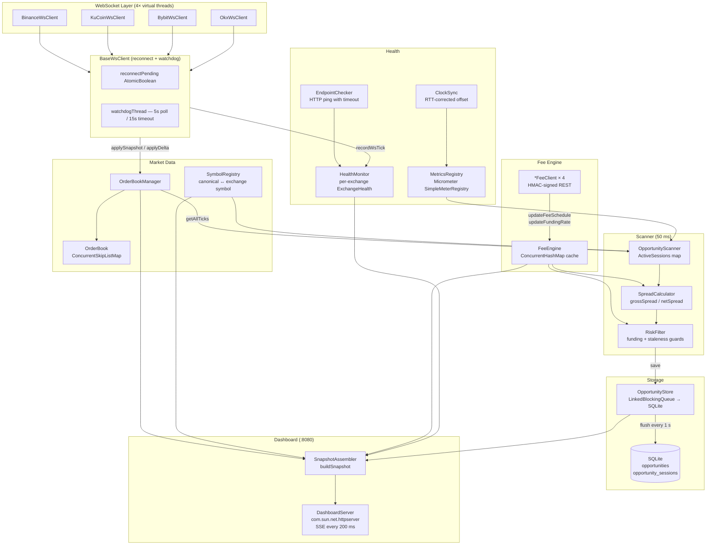

# arb-bot — Cross-Exchange Futures Arbitrage Scanner

**Phase 1 — Detection only. No order placement.**

arb-bot watches the USDT-margined perpetual futures order books of Binance, KuCoin, Bybit, and OKX simultaneously. Every 50 ms it computes depth-adjusted VWAP prices for 20 canonical symbols across all enabled exchanges, subtracts round-trip taker fees and estimated funding costs, and logs every directional pair whose net spread exceeds a configurable threshold. Results are stored in a local SQLite database and displayed on a live web dashboard at `http://localhost:8080/`.

The bot does **not** place orders. `Exchange.placeOrder()` is a stub that throws `UnsupportedOperationException`. Phase 2 (execution engine) is designed in `ARCHITECTURE.md` and `docs/research/` but not implemented.

---

## 📋 Table of Contents

1. [Quick Start](#-quick-start)
2. [How to Run](#-how-to-run)
3. [Architecture](#-architecture)
4. [Configuration Reference](#-configuration-reference)
5. [Exchange Integrations](#-exchange-integrations)
6. [Database](#-database)
7. [Terminal Output Explained](#-terminal-output-explained)
8. [Metrics](#-metrics)
9. [What to Watch Out For](#-what-to-watch-out-for)
10. [Phase 2 Preview](#-phase-2-preview)
11. [Development](#-development)
12. [Troubleshooting](#-troubleshooting)
13. [Appendix](#-appendix)

---

## 🚀 Quick Start

### Prerequisites

- Java 21+ (`java -version` must show `21` or higher)
- Gradle wrapper included — no separate Gradle install needed

### From zero to running in 5 steps

```bash
# 1. Clone and enter
git clone <repo-url> && cd arb-bot

# 2. (Optional) Set API keys for accurate fee schedules — bot runs without them
export BINANCE_API_KEY=xxx  BINANCE_API_SECRET=xxx
export BYBIT_API_KEY=xxx    BYBIT_API_SECRET=xxx
export OKX_API_KEY=xxx      OKX_API_SECRET=xxx  OKX_API_PASSPHRASE=xxx
export KUCOIN_API_KEY=xxx   KUCOIN_API_SECRET=xxx  KUCOIN_API_PASSPHRASE=xxx

# 3. Build
./gradlew build -x test

# 4. Run
./gradlew run

# 5. Verify — within 30 seconds you should see all four of these in logs/arbbot.log:
#   [binance] Snapshot applied for BTCUSDT, lastUpdateId=...
#   [kucoin]  Snapshot applied for XBTUSDTM, seq=...
#   [bybit]   Snapshot applied for BTCUSDT, seq=...
#   [okx]     Snapshot applied for BTC-USDT-SWAP, seqId=...
# Then open http://localhost:8080/ in a browser
```

> 📝 Without API keys the bot runs in public-data-only mode. Fee schedules fall back to conservative defaults (Binance 0.05%, KuCoin 0.06%, Bybit 0.06%, OKX 0.05%). Funding rates are always public.

---

## ⚙️ How to Run

There are three ways to run the bot. All of them ultimately do the same thing: compile your `.java` source files to `.class` bytecode and launch the JVM with the right classpath. The difference is in who manages the classpath and whether you have a debugger attached.

### Option 1: `./gradlew run` — quick terminal launch

Gradle compiles any changed files and starts the bot in one command. Good for a quick check or if you're not using an IDE.

**Pros:** Zero setup. Always uses the exact classpath Gradle resolves.  
**Cons:** Slightly slower start (Gradle daemon overhead). No debugger. Logs printed to terminal alongside Gradle output.

```bash
cd arb-bot
./gradlew run
```

With path overrides (so logs and DB go to fixed locations regardless of working directory):
```bash
./gradlew run \
  -Darbbot.log.dir=/absolute/path/arb-bot/logs \
  -Darbbot.storage.dbPath=/absolute/path/arb-bot/data/opportunities.db
```

**IntelliJ setup** (Gradle toolbar → right-click `run` → Modify Run Configuration):
- **VM options**: `-Darbbot.log.dir=/absolute/path/arb-bot/logs -Darbbot.storage.dbPath=/absolute/path/arb-bot/data/opportunities.db`

> 📝 These `-D` properties are forwarded from the Gradle process into the bot's JVM automatically via `build.gradle.kts`. Do **not** add `--enable-preview` or `-jar` here — those break the Gradle daemon.

---

### Option 2: IntelliJ Application run config — recommended for development

IntelliJ compiles incrementally in the background as you type, so by the time you hit Run it's already built. Full debugger support: set breakpoints, step through order book updates, inspect spread calculations live.

**Pros:** Fastest restart cycle. Debugger. IntelliJ highlights compile errors before you run.  
**Cons:** Requires initial setup. If you add a new dependency to `build.gradle.kts`, you must re-sync Gradle before it appears on the classpath.

**IntelliJ setup** (Run → Edit Configurations → `+` → Application):

| Field | Value |
|---|---|
| **Name** | Arb Bot |
| **Main class** | `com.arbbot.Main` |
| **Module** | `arb-bot.main` |
| **VM options** | `--enable-preview -Darbbot.log.dir=/absolute/path/arb-bot/logs -Darbbot.storage.dbPath=/absolute/path/arb-bot/data/opportunities.db` |
| **Working directory** | `/absolute/path/arb-bot` |
| **Environment variables** | `BINANCE_API_KEY=xxx;BINANCE_API_SECRET=xxx;...` |

The working directory matters for any relative paths that aren't overridden by `-D` properties.

---

### Option 3: Fat JAR — run without IntelliJ or Gradle

Build a single self-contained JAR with all dependencies bundled inside. Drop it anywhere and run with plain `java`. Useful for running on a remote server or outside of a development environment.

**Pros:** No Gradle or IntelliJ needed at runtime. Portable single file.  
**Cons:** Must rebuild the JAR after every code change (`./gradlew shadowJar`). No debugger.

```bash
# Build (from arb-bot/ directory)
./gradlew shadowJar
# Output: build/libs/arb-bot.jar  (~25 MB, all dependencies bundled)

# Run
java --enable-preview \
  -Darbbot.log.dir=/absolute/path/arb-bot/logs \
  -Darbbot.storage.dbPath=/absolute/path/arb-bot/data/opportunities.db \
  -jar build/libs/arb-bot.jar
```

> 📝 `--enable-preview` is required because the project uses Java 21 preview features (pattern matching in switch expressions). The fat JAR does not auto-apply JVM flags — you must pass it explicitly.

---

### JVM system properties

Two properties let you pin file locations regardless of working directory:

| Property | Controls | Default (if not set) |
|---|---|---|
| `-Darbbot.log.dir` | Directory for `arbbot.log` and rotated `.gz` files | `logs/` relative to working directory |
| `-Darbbot.storage.dbPath` | Full path to the SQLite database file | `data/opportunities.db` relative to working directory |

### Environment variables

| Variable | Exchange | Required for | Effect if absent |
|---|---|---|---|
| `BINANCE_API_KEY` | Binance | Fee schedule | Falls back to `FeeSchedule.defaultFor("binance")` — taker 0.0005 |
| `BINANCE_API_SECRET` | Binance | Fee schedule | Same |
| `KUCOIN_API_KEY` | KuCoin | Future auth endpoints | No current effect — fees fetched from public endpoint |
| `KUCOIN_API_SECRET` | KuCoin | Future auth endpoints | Same |
| `KUCOIN_API_PASSPHRASE` | KuCoin | Future auth endpoints | Same |
| `BYBIT_API_KEY` | Bybit | Fee schedule | Falls back to `FeeSchedule.defaultFor("bybit")` — taker 0.0006 |
| `BYBIT_API_SECRET` | Bybit | Fee schedule | Same |
| `OKX_API_KEY` | OKX | Fee schedule | Falls back to `FeeSchedule.defaultFor("okx")` — taker 0.0005 |
| `OKX_API_SECRET` | OKX | Fee schedule | Same |
| `OKX_API_PASSPHRASE` | OKX | Fee schedule | Same |

> ⚠️ **Financial risk**: Running without API keys means the bot uses generic taker rates. If your actual fee tier is lower (e.g., BNB discount on Binance), the bot will underestimate net spreads and miss real opportunities. If your tier is higher than the default, it may log false positives.

### Config file override

All keys in `application.conf` can be overridden without modifying the file:

```bash
# Override from a separate file
./gradlew run -Dconfig.file=/path/to/my.conf

# my.conf only needs the keys you want to change — it merges with the defaults:
arbbot {
  scanner {
    minNetSpreadPercent = 0.02
    orderSizeUsdt = 5000
  }
  exchanges.kucoin.enabled = false
}
```

The config library (`com.typesafe:config:1.4.3`) resolves in this order: system properties → environment variables → `config.file` → `application.conf`.

### Run health check only

```bash
./scripts/check-endpoints.sh
# Runs ./gradlew test --tests "*IntegrationTest" -Dtest.tags=integration
# Hits live Binance and Bybit ping endpoints — requires internet access
```

### Stopping cleanly

Use `Ctrl+C` or `kill <pid>` — both trigger the JVM shutdown hook registered in `Main.main()`. The hook:
1. Stops the SSE pusher and HTTP server
2. Shuts down the scan scheduler
3. Shuts down the health scheduler
4. Disconnects all WS clients
5. Logs final stats (total opportunities, max net spread)
6. Calls `OpportunityStore.close()` — flushes pending buffer to SQLite and closes the connection

> ⚠️ **Force-kill (`kill -9`) skips the shutdown hook**. Any `Opportunity` objects in the `LinkedBlockingQueue` buffer that haven't been flushed yet will be lost. SQLite itself is transactional and will not be corrupted, but the last flush interval of data (default 1 second) may be missing.

---

## 🏗 Architecture

### Component diagram



### Data flow: raw WebSocket frame → logged opportunity

| Step | Where | What happens |
|---|---|---|
| 1 | `OkHttpClient` → `BaseWsClient.onMessage()` | `lastMessageAt.set(now)` — resets watchdog clock |
| 2 | `BaseWsClient.onMessage()` | Delegates to `handleMessage(ws, text)` in subclass |
| 3 | `*WsClient.handleMessage()` | `ObjectMapper.readTree(text)` — single shared mapper per class |
| 4a | Binance / KuCoin | If `snapshotInProgress`: add to `CopyOnWriteArrayList` pending buffer; else `book.applyDelta(bids, asks, -1L)` |
| 4b | Bybit / OKX | `type=snapshot` → `book.applySnapshot()`; `type=delta` / `action=update` → `book.applyDelta()` |
| 5 | `OrderBook.applyDelta()` | `ConcurrentSkipListMap` `put` / `remove`; qty=0 removes level |
| 6 | After apply | `healthMonitor.recordWsTick(exchange)` |
| 7 | `OpportunityScanner.scan()` every 50 ms | `symbolRegistry.getWatchedSymbols()` → for each canonical symbol |
| 8 | `OrderBookManager.getAllTicks()` | `book.effectiveBuyPrice(orderSizeUsdt)` + `effectiveSellPrice()` → `Tick` |
| 9 | `SpreadCalculator.grossSpread(buyTick, sellTick)` | `(sellPrice - buyPrice) / buyPrice` |
| 10 | Sanity cap | Skip if `gross > maxGrossSpreadPercent / 100` (default 3%) |
| 11 | `SpreadCalculator.netSpread()` | `gross - feeEngine.getTotalRoundTripCost(...)` |
| 12 | Threshold check | Skip if `net < minNetSpreadPercent / 100` (default 0.05%) |
| 13 | `RiskFilter.passes()` | Rejects if: either tick unreliable, `abs(fundingRate) > 0.1%`, settlement within 5 min |
| 14 | `OpportunityStore.save(opp)` | `LinkedBlockingQueue.offer(opp)` — non-blocking |
| 15 | `ActiveSession` update | Increment `tickCount`, update `peakNet`, set `seenThisScan = true` |
| 16 | `OpportunityStore.flush()` every 1 s | `drainTo(batch)` → `PreparedStatement.executeBatch()` → `connection.commit()` |
| 17 | Session close (after ~500 ms gap) | `OpportunityStore.saveSession(session)` → `opportunity_sessions` table |

### Latency budget

| Component | Configured value | Notes |
|---|---|---|
| WS depth update frequency | 100 ms (Binance), ~100 ms (KuCoin/Bybit/OKX) | Exchange-side push rate |
| Scanner interval | `scanIntervalMs = 50` ms | Fixed-rate, virtual thread scheduler |
| Worst-case scan lag | 50 ms | Scanner just missed last tick |
| `effectiveBuyPrice()` / `effectiveSellPrice()` | O(depth) walk | Typically 1–5 levels for $1000 |
| WS stale threshold | `wsStaleThresholdMs = 2000` ms | Feed marked stale if silent |
| Watchdog trigger | 15 000 ms | Force-reconnects silently-dead sockets |
| DB flush | `flushIntervalMs = 1000` ms | Batch INSERT |
| SSE push | 200 ms | Dashboard update rate |
| Snapshot fetch timeout | `endpointTimeoutMs = 5000` ms | REST health check only |

---

## 🔧 Configuration Reference

All keys live under the `arbbot` prefix in `src/main/resources/application.conf`.

### `arbbot.exchanges.<name>`

| Key | Type | Default | Effect |
|---|---|---|---|
| `enabled` | boolean | `true` | If `false`, exchange is skipped entirely at startup — no endpoint check, no WS connection |
| `restBaseUrl` | string | (per exchange) | Base URL for all REST calls |
| `wsBaseUrl` | string | (per exchange) | WebSocket URL (KuCoin appends token at runtime) |
| `apiKey` | string? | `${?ENV_VAR}` | From environment. `null` if env var unset |
| `apiSecret` | string? | `${?ENV_VAR}` | From environment |
| `apiPassphrase` | string? | `${?ENV_VAR}` | OKX and KuCoin only |
| `feeRefreshIntervalMinutes` | int | `30` | How often to re-fetch fee schedules (not yet wired to a scheduler — fetched once at startup) |
| `fundingRateRefreshIntervalMinutes` | int | `5` | Same status — fetched once at startup |

> 📝 `feeRefreshIntervalMinutes` and `fundingRateRefreshIntervalMinutes` are read by `AppConfig` and available via `ExchangeConfig` but no background scheduler currently calls the fee clients on a timer. The values are designed for Phase 2.

### `arbbot.scanner`

| Key | Type | Default | Effect |
|---|---|---|---|
| `minNetSpreadPercent` | double | `0.05` | Minimum net spread (after fees + funding) to log an opportunity. 0.05 = 0.05% |
| `maxGrossSpreadPercent` | double | `3.0` | Sanity cap — skip if gross spread exceeds this (likely stale data or mismatched symbols) |
| `orderSizeUsdt` | double | `1000` | Notional used for VWAP depth calculation. Also stored with each opportunity |
| `scanIntervalMs` | long | `50` | How often `OpportunityScanner.scan()` runs in milliseconds |
| `symbols` | list | 20 symbols | Canonical ticker list: BTC, ETH, SOL, BNB, XRP, DOGE, LINK, AVAX, ADA, DOT, LTC, TRX, SUI, APT, NEAR, TON, UNI, ATOM, HBAR, OP |

**Tuning `orderSizeUsdt`**: Larger values walk deeper into the book and increase slippage in the effective price. At `$1000` most top-10-level books have sufficient depth; at `$50000` you may see empty `OptionalDouble` returns for illiquid symbols, which mark the tick unreliable.

**Tuning `minNetSpreadPercent`**: The default 0.05% (~$0.50 on a $1000 trade) is intentionally tight. In practice, consistent spreads above 0.1% are uncommon. Set to 0.0 to log all positive-net opportunities for research.

### `arbbot.risk`

| Key | Type | Default | Effect |
|---|---|---|---|
| `maxFundingRatePercent` | double | `0.1` | Reject opportunity if `abs(fundingRate)` exceeds this on either leg. 0.1 = 0.1%. Prevents entering when one side has extreme funding that could eat the spread |
| `minFundingTimeBufferMinutes` | long | `5` | Reject if funding settles within this many minutes. Entering 4 minutes before an 8-hour settlement means paying that funding immediately |

### `arbbot.health`

| Key | Type | Default | Effect |
|---|---|---|---|
| `checkIntervalSeconds` | long | `30` | How often `HealthMonitor.checkStaleness()` runs |
| `wsStaleThresholdMs` | long | `2000` | Feed marked stale (and ticks unreliable) if no WS message in this many ms |
| `endpointTimeoutMs` | long | `5000` | REST health check timeout at startup |

### `arbbot.storage`

| Key | Type | Default | Effect |
|---|---|---|---|
| `dbPath` | string | `data/opportunities.db` | SQLite file path, relative to working directory. Parent directories are created automatically |
| `flushIntervalMs` | long | `1000` | How often the `LinkedBlockingQueue` is drained to SQLite |

### `arbbot.dashboard`

| Key | Type | Default | Effect |
|---|---|---|---|
| `enabled` | boolean | `true` | Set to `false` to disable the HTTP server entirely |
| `port` | int | `8080` | Port for the dashboard and SSE stream |

### Pointing at testnet

```hocon
# local-testnet.conf
arbbot {
  exchanges {
    binance {
      restBaseUrl = "https://testnet.binancefuture.com"
      wsBaseUrl   = "wss://stream.binancefuture.com"
    }
    kucoin.enabled  = false
    bybit.enabled   = false
    okx.enabled     = false
  }
  scanner {
    symbols = ["BTC", "ETH"]
    orderSizeUsdt = 100
  }
}
```

```bash
./gradlew run -Dconfig.file=local-testnet.conf
```

---

## 🔌 Exchange Integrations

### Binance Futures

| Property | Value |
|---|---|
| REST base | `https://fapi.binance.com` |
| WS URL | `wss://fstream.binance.com/stream?streams=<sym>@depth@100ms/...` |
| Depth stream | Combined stream: up to 200 symbols per connection, 100 ms incremental |
| Snapshot endpoint | `GET /fapi/v1/depth?symbol=BTCUSDT&limit=100` |
| Snapshot field | `lastUpdateId` |
| Delta fields | `U` (first update ID), `u` (final update ID), `b`/`a` arrays of `[price, qty]` |
| Sequence mode | `seqNum=-1` (gap detection disabled in `applyDelta`; Binance sends absolute quantities so gaps cause only transient staleness) |
| Fee endpoint | `GET /fapi/v1/commissionRate` — requires `X-MBX-APIKEY` header + HMAC-SHA256 signature on query string |
| Funding endpoint | `GET /fapi/v1/premiumIndex` — public |
| Heartbeat | None needed — OkHttp responds to server-level WebSocket ping frames automatically |
| Default taker fee | `0.0005` (0.05%) |
| Symbol format | `BTCUSDT` — perpetual USDT-margined only (`contractType=PERPETUAL`, `marginAsset=USDT`) |

**Known quirks:**
- Combined stream endpoint (`/stream?streams=...`) does **not** accept application-level JSON messages. Sending `{"method":"ping"}` triggers close code `1008 Invalid request`. This was a root cause of repeated disconnects and has been fixed by removing `schedulePing()`.
- Binance closes all WS connections after 24 hours regardless of activity. The watchdog (15 s stale detection) handles forced reconnects.

### KuCoin Futures

| Property | Value |
|---|---|
| REST base | `https://api-futures.kucoin.com` |
| WS URL | Dynamic: `POST /api/v1/bullet-public` returns token + endpoint. URL: `{endpoint}?token={token}&connectId={uuid}` |
| Depth topic | `/contractMarket/level2:{symbol}` |
| Delta format | `data.change`: pipe-delimited `price,side,qty` entries. `buy`=bid, `sell`=ask. `qty=0` removes level |
| Snapshot endpoint | `GET /api/v1/level2/snapshot?symbol=BTCUSDTM` — REST-fetched after WS subscription |
| Snapshot field | `data.sequence` |
| Sequence mode | `seqNum=-1` (absolute quantities — same rationale as Binance) |
| Fee endpoint | `GET /api/v1/contracts/active` — public, includes `makerFeeRate` + `takerFeeRate` per contract |
| Funding endpoint | `GET /api/v1/funding-rate/{symbol}/current` — public |
| Heartbeat | Send `{"id":"...", "type":"ping"}` every `pingInterval` ms (retrieved from `bullet-public` response, typically 18 000 ms). Expect `{"type":"pong"}` |
| Default taker fee | `0.0006` (0.06%) |
| Symbol format | `XBTUSDTM` for BTC (KuCoin uses legacy `XBT` ticker). `SymbolRegistry` maps `XBT → BTC` automatically |

**Known quirks:**
- KuCoin Bitcoin symbol is `XBTUSDTM` not `BTCUSDTM`. `SymbolRegistry.parseSymbols()` has `if ("XBT".equals(base)) base = "BTC"` to handle this.
- `nextSettlement` for KuCoin funding rate is not available from `/api/v1/funding-rate/{symbol}/current`. The field is set to `Instant.MAX` and the dashboard shows `—` in the countdown column.

### Bybit

| Property | Value |
|---|---|
| REST base | `https://api.bybit.com` |
| WS URL | `wss://stream.bybit.com/v5/public/linear` |
| Subscribe | `{"op":"subscribe","args":["orderbook.50.BTCUSDT"]}` — 50-level book |
| Snapshot | First WS message with `type=snapshot`, field `data.seq` |
| Delta | `type=delta`, uses `seqNum=-1` (absolute quantities) |
| Fee endpoint | `GET /v5/account/fee-rate` — requires `X-BAPI-API-KEY`, `X-BAPI-SIGN`, `X-BAPI-TIMESTAMP`, `X-BAPI-RECV-WINDOW` headers. HMAC payload: `timestamp + apiKey + recvWindow + queryString` |
| Funding endpoint | `GET /v5/market/tickers?category=linear&symbol=X` — public |
| Heartbeat | Send `{"op":"ping"}` every 20 000 ms. Expect `{"op":"pong"}` |
| Default taker fee | `0.0006` (0.06%) |
| Symbol format | `BTCUSDT` — only `contractType=LinearPerpetual` symbols ending in `USDT` |
| Symbol list | `GET /v5/market/instruments-info?category=linear&limit=1000` — `limit=1000` required; default 500 misses SOL and XRP alphabetically |

**Known quirks:**
- The instruments endpoint paginates at 500 rows with default params. `Main.symbolPathFor("bybit")` uses `&limit=1000` to retrieve all symbols in one call.
- Symbol base coin is read from `baseCoin` API field, not string manipulation on the symbol name.

### OKX

| Property | Value |
|---|---|
| REST base | `https://www.okx.com` |
| WS URL | `wss://ws.okx.com:8443/ws/v5/public` |
| Subscribe | `{"op":"subscribe","args":[{"channel":"books","instId":"BTC-USDT-SWAP"}]}` — 400-level book, 100 ms push |
| Snapshot | `action=snapshot`, field `data[0].seqId` |
| Delta | `action=update`, uses `seqNum=-1` |
| Level format | `[price, qty, deprecated, numOrders]` — only `[0]` and `[1]` are used |
| Fee endpoint | `GET /api/v5/account/trade-fee` — requires `OK-ACCESS-KEY`, `OK-ACCESS-SIGN`, `OK-ACCESS-TIMESTAMP`, `OK-ACCESS-PASSPHRASE`. HMAC: `Base64(HMAC-SHA256(secret, timestamp + "GET" + path))` |
| Funding endpoint | `GET /api/v5/public/funding-rate?instId=BTC-USDT-SWAP` — public |
| Heartbeat | Send plain string `"ping"` every 25 000 ms. Expect plain string `"pong"` |
| Default taker fee | `0.0005` (0.05%) |
| Symbol format | `BTC-USDT-SWAP` — only `instType=SWAP` and `ctType=linear` |

**Known quirks:**
- OKX `makerU` field in fee response can be **negative** (maker rebate). This is handled correctly — the bot passes the raw value to `FeeSchedule` which is subtracted from gross spread, making opportunities with maker fills look better (but the scanner uses taker rates as conservative assumption).
- `"ping"` / `"pong"` are plain strings, not JSON.

### WebSocket self-healing (all exchanges)

`BaseWsClient` implements two independent reconnect paths:

1. **Server-initiated close** (`onClosing` / `onClosed`): `onClosing` immediately calls `scheduleReconnect()` with exponential backoff (100 ms → 200 ms → ... → 30 s cap). `reconnectPending` `AtomicBoolean` prevents `onClosed` from scheduling a duplicate.

2. **Silent death watchdog**: A background virtual thread checks `lastMessageAt` every 5 000 ms. If the socket is marked connected but no message has arrived in 15 000 ms, `forceReconnect()` cancels the TCP connection and schedules a fresh connection immediately.

`onOpen()` resets both `reconnectAttempts` and `reconnectPending`.

---

## 💾 Database

Location: `data/opportunities.db` (default). Created automatically on first run.

### Schema

#### `opportunities` table

| Column | Type | Description |
|---|---|---|
| `id` | TEXT PK | UUID v4 — unique per individual scan tick that exceeded the threshold |
| `canonical_symbol` | TEXT | Base ticker: `BTC`, `ETH`, etc. |
| `long_exchange` | TEXT | Exchange where the bot would buy (long). One of: `binance`, `kucoin`, `bybit`, `okx` |
| `long_ask_price` | REAL | VWAP effective ask price at `orderSizeUsdt` on the long exchange |
| `short_exchange` | TEXT | Exchange where the bot would sell (short) |
| `short_bid_price` | REAL | VWAP effective bid price at `orderSizeUsdt` on the short exchange |
| `gross_spread_pct` | REAL | `(shortBid - longAsk) / longAsk` — before any costs |
| `net_spread_pct` | REAL | `grossSpread - totalRoundTripCost` |
| `estimated_cost_pct` | REAL | `2 × (takerA + takerB) + netFundingCost` |
| `long_funding_rate` | REAL | Current funding rate on long exchange (nullable if unavailable) |
| `short_funding_rate` | REAL | Current funding rate on short exchange (nullable) |
| `long_next_funding` | TEXT | ISO-8601 `Instant` of next settlement on long exchange (nullable) |
| `short_next_funding` | TEXT | ISO-8601 `Instant` of next settlement on short exchange (nullable) |
| `order_size_usdt` | REAL | Notional used for depth calculation (from `scanner.orderSizeUsdt` at time of detection) |
| `detected_at` | TEXT | ISO-8601 `Instant.now()` at time of detection |

**Indexes:**
- `idx_opp_symbol` on `canonical_symbol` — fast per-symbol queries
- `idx_opp_time` on `detected_at` — chronological scans
- `idx_opp_net_spread` on `net_spread_pct DESC` — fast top-N spread queries

#### `opportunity_sessions` table

One row per continuous window where a given `(symbol, longExchange, shortExchange)` triple remained above the `minNetSpreadPercent` threshold. A session closes after 10 consecutive scans (~500 ms) without the triple appearing.

| Column | Type | Description |
|---|---|---|
| `id` | TEXT PK | UUID assigned when the session first opens |
| `canonical_symbol` | TEXT | Base ticker |
| `long_exchange` | TEXT | Long leg exchange |
| `short_exchange` | TEXT | Short leg exchange |
| `started_at` | TEXT | ISO-8601 `Instant` when the first qualifying scan tick was seen |
| `ended_at` | TEXT | ISO-8601 `Instant` when the session was closed (after gap) |
| `peak_net_pct` | REAL | Maximum `net_spread_pct` seen during the session (as percentage, e.g. 0.12) |
| `avg_net_pct` | REAL | Mean `net_spread_pct` across all ticks |
| `duration_ms` | INTEGER | `ended_at - started_at` in milliseconds |
| `tick_count` | INTEGER | Number of 50 ms scan ticks where this triple qualified |

**Indexes:**
- `idx_sess_symbol` on `canonical_symbol`
- `idx_sess_ended` on `ended_at DESC` — dashboard loads recent sessions

### Useful queries

```sql
-- All-time summary
SELECT COUNT(*) AS total_opps,
       MAX(net_spread_pct)*100 || '%' AS best_net,
       AVG(net_spread_pct)*100 || '%' AS avg_net,
       MIN(detected_at) AS first_seen,
       MAX(detected_at) AS last_seen
FROM opportunities;

-- Best net spread per symbol
SELECT canonical_symbol,
       MAX(net_spread_pct)*100 AS best_net_pct,
       COUNT(*) AS tick_count
FROM opportunities
GROUP BY canonical_symbol
ORDER BY best_net_pct DESC;

-- Most active exchange pairs
SELECT long_exchange || ' → ' || short_exchange AS pair,
       COUNT(*) AS ticks,
       MAX(net_spread_pct)*100 AS best_pct
FROM opportunities
GROUP BY long_exchange, short_exchange
ORDER BY ticks DESC;

-- Last 20 raw ticks above 0.1% net
SELECT canonical_symbol, long_exchange, short_exchange,
       ROUND(gross_spread_pct*100,4) AS gross_pct,
       ROUND(net_spread_pct*100,4) AS net_pct,
       detected_at
FROM opportunities
WHERE net_spread_pct > 0.001
ORDER BY detected_at DESC
LIMIT 20;

-- Session history: longest-duration opportunities
SELECT canonical_symbol,
       long_exchange || ' → ' || short_exchange AS direction,
       ROUND(peak_net_pct,4) || '%' AS peak,
       ROUND(avg_net_pct,4) || '%' AS avg,
       ROUND(duration_ms/1000.0,1) || 's' AS duration,
       tick_count,
       ended_at
FROM opportunity_sessions
ORDER BY duration_ms DESC
LIMIT 20;

-- Sessions with best peak spread
SELECT canonical_symbol,
       long_exchange || ' → ' || short_exchange AS direction,
       ROUND(peak_net_pct,4) || '%' AS peak,
       tick_count,
       ended_at
FROM opportunity_sessions
ORDER BY peak_net_pct DESC
LIMIT 10;

-- Hourly opportunity frequency
SELECT strftime('%Y-%m-%d %H:00', detected_at) AS hour,
       COUNT(*) AS ticks
FROM opportunities
GROUP BY hour
ORDER BY hour DESC
LIMIT 24;

-- Opportunities within the last 1 hour
SELECT canonical_symbol, long_exchange, short_exchange,
       ROUND(net_spread_pct*100,4) AS net_pct,
       detected_at
FROM opportunities
WHERE detected_at > datetime('now', '-1 hour')
ORDER BY net_spread_pct DESC;
```

### Data growth estimate

At the default `minNetSpreadPercent = 0.05%` and 20 symbols across 4 exchanges (12 directional pairs each), opportunities are rare. In quiet markets: ~100–500 rows/day. In volatile conditions: up to ~50 000 rows/day. Each row is approximately 250 bytes.

| Scenario | Rows/day | Size/day | Size/month |
|---|---|---|---|
| Quiet | 500 | 125 KB | 3.75 MB |
| Moderate | 10 000 | 2.5 MB | 75 MB |
| Volatile | 50 000 | 12.5 MB | 375 MB |

Sessions table is much smaller — typically 1–5 sessions per day per pair at 0.05% threshold.

---

## 📟 Terminal Output Explained

Logs are written in **Logstash JSON format** to both stdout and `logs/arbbot.log`. Each line is a JSON object. The `message` field contains the human-readable text shown below.

> 💡 To read logs as plain text during development: `tail -f logs/arbbot.log | jq -r '.message'`

### Startup sequence (annotated)

```
=== ARB BOT STARTING ===
Checking exchange endpoints...
[binance] Connecting to https://fapi.binance.com/fapi/v1/ping    ← EndpointChecker REST ping
[binance] Clock offset: 12ms                                       ← ClockSync RTT-corrected; warns if >500ms
[kucoin]  Clock offset: -8ms
[bybit]   Clock offset: 3ms
[okx]     Clock offset: 21ms
Waiting for order book snapshots...
[binance] Connecting to wss://fstream.binance.com/stream?streams=btcusdt@depth@100ms/...
[binance] WebSocket connected                                      ← onOpen() fired; snapshot fetch threads start
[binance] Snapshot applied for BTCUSDT, lastUpdateId=4567890123   ← book initialized; pending deltas replayed
[binance] Snapshot applied for ETHUSDT, lastUpdateId=3456789012
... (one line per symbol per exchange)
[kucoin]  Snapshot applied for XBTUSDTM, seq=89012345
[bybit]   Snapshot applied for BTCUSDT, seq=1234567
[okx]     Snapshot applied for BTC-USDT-SWAP, seqId=98765432
OpportunityStore started: data/opportunities.db
Dashboard started on port 8080
=== ARB BOT STARTED ===
Exchanges: [binance, kucoin, bybit, okx]
Symbols: [BTC, ETH, SOL, BNB, XRP, DOGE, LINK, AVAX, ADA, DOT, LTC, TRX, SUI, APT, NEAR, TON, UNI, ATOM, HBAR, OP]
Scanning every 50ms | Min net spread: 0.05%
Dashboard: http://localhost:8080/
```

### Healthy running output

When running normally, the bot produces almost no log output — all scanning happens silently. You will see:

```
OPPORTUNITY: sym=ETH long=binance short=okx gross=0.18% net=0.07%
OPPORTUNITY: sym=BTC long=kucoin short=bybit gross=0.22% net=0.11%
Closed 1 opportunity sessions                                      ← session flushed to DB
Flushed 847 opportunities to SQLite                                ← batch INSERT every 1s
[binance] WS feed recovered                                        ← after reconnect
```

### Opportunity log line: field-by-field

```
OPPORTUNITY: sym=BTC long=binance short=okx gross=0.18% net=0.07%
              │        │              │        │           └── net spread after fees+funding
              │        │              │        └── (shortBid - longAsk) / longAsk × 100
              │        │              └── exchange where short (sell) leg would be placed
              │        └── exchange where long (buy) leg would be placed
              └── canonical symbol (base ticker)
```

`gross` uses `Tick.effectiveBuyPrice` and `Tick.effectiveSellPrice` — both are VWAP at `orderSizeUsdt`, not best bid/ask.

### Log levels (from `logback.xml`)

| Logger | Level | What it logs |
|---|---|---|
| `com.arbbot` | DEBUG | All application code including rejected opportunities, funding rate warnings |
| `okhttp3` | WARN | Only OkHttp errors/warnings (connection failures, TLS issues) |
| Root | INFO | Anything not matched above |

### Warning and error patterns

| Log message | Cause | Remediation |
|---|---|---|
| `[binance] WebSocket closing: 1008 Invalid request` | Binance rejected an invalid application-level message (should not occur after fix) | Check no app-level pings are being sent to combined stream |
| `[binance] Watchdog: no message for 15s — forcing reconnect` | Socket silently died (NAT timeout, server idle close) | Normal — bot reconnects automatically |
| `[binance] WS feed marked STALE — no tick in 2000ms` | No message received in `wsStaleThresholdMs`. Book data now unreliable | Usually precedes reconnect. If persistent, check network |
| `[binance] WS feed recovered` | Feed resumed after staleness | Informational |
| `[binance] REST endpoint down — skipping this exchange` | Startup ping failed. Exchange is removed from `enabledExchanges` | Check connectivity to the exchange. Exchange will not participate in this session |
| `[binance] Clock offset 1200ms exceeds 500ms threshold — order placement may fail in Phase 2` | System clock is drifted vs. exchange server time | Sync system clock (`timedatectl sync` / NTP). No functional impact in Phase 1 |
| `[kucoin] Failed to get WS token: …` | `POST /api/v1/bullet-public` failed | KuCoin API may be rate-limiting. Bot falls back to `ws://invalid` and retries on reconnect |
| `[kucoin] Snapshot HTTP 429 for XBTUSDTM: …` | Rate limit during snapshot fetch | Automatic retry on next reconnect. Consider increasing `scanIntervalMs` |
| `[kucoin] sequence=0 for XBTUSDTM` | Snapshot returned invalid data | Snapshot fetch retries on reconnect |
| `Fee schedule missing for binance:BTC, using default` | API key not set or request failed | Set `BINANCE_API_KEY` + `BINANCE_API_SECRET` for accurate fees |
| `Opportunities flush failed: …` | SQLite write error | Check disk space, file permissions, and that `data/` directory is writable |
| `[bybit] Message parse error: …` | Unexpected JSON from Bybit | Usually harmless (heartbeat frames). Report if persistent |
| `[okx] fetchFeeSchedule failed for BTC-USDT-SWAP: HTTP 401` | OKX API credentials invalid or passphrase wrong | Verify `OKX_API_KEY`, `OKX_API_SECRET`, `OKX_API_PASSPHRASE` |

---

## 📊 Metrics

All metrics use `SimpleMeterRegistry` (in-process only, no export). Access via `MetricsRegistry.getRegistry()` in code; there is no HTTP endpoint for metrics in Phase 1.

| Metric name | Type | Tags | What it measures | Alert threshold |
|---|---|---|---|---|
| `arb.ticks.received` | Counter | `exchange`, `symbol` | Total WS messages processed per exchange/symbol | — |
| `arb.orderbook.updates` | Counter | `exchange`, `symbol` | Successful `applyDelta` calls | — |
| `arb.orderbook.resyncs` | Counter | `exchange`, `symbol` | Sequence gap detections triggering re-sync | > 5/min suggests instability |
| `arb.ws.reconnects` | Counter | `exchange` | WS reconnection attempts (watchdog + normal close) | > 3/hour |
| `arb.opportunities.detected` | Counter | `symbol`, `pair` (`longEx->shortEx`) | Qualifying opportunities above `minNetSpreadPercent` | — |
| `arb.opportunity.net_spread` | Gauge | `symbol`, `pair` | Last detected net spread as fraction (divided by 1 000 000 internally for precision) | — |
| `arb.exchange.health` | Gauge | `exchange`, `type` (`rest`/`ws`) | `1.0` = alive, `0.0` = down/stale | `0.0` for REST type |
| `arb.clock.offset_ms` | Gauge | `exchange` | RTT-corrected clock offset in milliseconds | `abs(value) > 500` |
| `arb.scan.duration_ms` | Timer | (none) | Time taken by `OpportunityScanner.scan()` | P99 > 10 ms |

---

## ⚠️ What to Watch Out For

> ⚠️ **All items below are based on the actual code. Understand them before operating at significant size.**

1. **Phase 1 does not trade.** `Exchange.placeOrder()` throws `UnsupportedOperationException`. Every opportunity is observation only.

2. **Fee defaults are conservative but not precise.** Without API keys, `FeeSchedule.defaultFor()` uses flat taker rates. If you have a VIP tier (e.g., Binance 0.02% taker), the bot is systematically underestimating net spreads. If you have a higher rate, it may show false positives.

3. **Funding rate is sampled once at startup.** There is no background refresh of funding rates despite `fundingRateRefreshIntervalMinutes` existing in config. A funding rate that was 0.01% at startup could be 0.09% three hours later. Phase 2 must implement the refresh loop.

4. **`maxFundingRatePercent = 0.1%` applies to absolute value.** A negative funding rate of -0.15% (longs receive funding) also triggers rejection. This is intentional — extreme negative rates suggest the market is in unusual stress. To always allow negative funding, lower the threshold.

5. **`minFundingTimeBufferMinutes = 5` only checks the next settlement.** If settlement just passed and the next one is 7h55m away, the check passes. The actual cost is computed as `fundingRate × (holdingHours / 8)` — which assumes a constant rate over 4 holding hours.

6. **`orderSizeUsdt = 1000` is the detection size, not a position size cap.** The depth-adjusted price at $1000 may look great; at $10000 the effective price could be 0.3% worse, turning the spread negative.

7. **The scanner runs every 50 ms on a single virtual thread.** With 20 symbols × 12 pairs × 2 directions = 480 evaluations per scan, plus `effectiveBuyPrice()` / `effectiveSellPrice()` depth walks, scans typically complete in < 2 ms. If `arb.scan.duration_ms` P99 exceeds 10 ms, reduce the symbol list or increase `scanIntervalMs`.

8. **`wsStaleThresholdMs = 2000` is aggressive.** In low-liquidity hours, some symbols on some exchanges may not trade for 2 seconds, causing healthy books to be marked stale. Increase to 5000–10000 ms for less liquid symbols.

9. **KuCoin `nextSettlement` is always `Instant.MAX`.** The current-funding-rate endpoint does not return settlement time. The `minFundingTimeBufferMinutes` check always passes for KuCoin because `Instant.MAX.isBefore(Instant.now().plusSeconds(...))` is always false.

10. **Sequence validation is intentionally relaxed.** For Binance and KuCoin, `applyDelta(bids, asks, -1L)` is called with `seqNum=-1`, disabling gap detection. These exchanges publish absolute quantities per level (not delta-from-previous), so a missed message causes only transient staleness rather than book corruption. Bybit and OKX also use `-1L` for the same reason.

11. **SQLite has no connection pool.** All reads and writes go through a single `synchronized` `Connection`. At high opportunity frequencies (thousands of ticks/second), the flush thread and query methods (`queryStats`, `queryRecent`, `queryRecentSessions`) contend on the same lock. This is fine for Phase 1 read-only dashboard queries but would need `WAL mode` or a connection pool before Phase 2.

12. **The shutdown hook runs in a new virtual thread.** If the JVM receives `SIGKILL` (not `SIGTERM` / `Ctrl+C`), no cleanup occurs. Always use `kill <pid>` (which sends `SIGTERM`) or `Ctrl+C` to allow the store to flush.

13. **No rate limiting on REST calls.** `RateLimiter` exists in `com.arbbot.util` but is not wired to any fee client. During startup, fee schedules and funding rates for all 20 symbols are fetched in a tight loop. With 4 exchanges × 20 symbols = 80 REST calls at startup, you may hit Binance's `1200 request/minute` limit if restarted frequently.

14. **Clock offset warning is informational only.** `ClockSync` warns at > 500 ms offset but the bot continues running. In Phase 1 this has no functional impact. In Phase 2, Binance and Bybit require signed timestamps within a `recvWindow` (5000 ms default). A 1000 ms clock offset plus network latency could push authenticated requests outside this window.

---

## 🔮 Phase 2 Preview

Phase 2 adds execution. The `Exchange.placeOrder()` stub becomes a real implementation. From `ARCHITECTURE.md`:

**What it adds:**
- `ExecutionEngine` interface with `execute(Opportunity, double sizeUsdt)` → `CompletableFuture<ExecutionResult>`
- Dual-leg simultaneous placement via `CompletableFuture`
- Sealed `LegResult` hierarchy: `Filled`, `PartialFill`, `Rejected`, `Timeout`, `Error`
- `ExecutionStatus` enum: `BOTH_FILLED`, `LONG_FILLED_SHORT_FAILED`, etc.
- Emergency single-leg unwind when one leg fails
- Position state machine: `PENDING_OPEN → OPEN → PENDING_CLOSE → CLOSED` / `EMERGENCY_CLOSE`

**What stubs exist now:**
- `Exchange.placeOrder(symbol, side, qty)` — defined in interface, throws `UnsupportedOperationException`
- `ClockSync.now(exchange)` — RTT-corrected timestamp ready for authenticated requests
- `HmacSha256.hex()` and `HmacSha256.base64()` — both signing modes implemented
- `RateLimiter` token bucket — ready for per-exchange instantiation

**Config keys needed for Phase 2** (not currently in `application.conf`):
```hocon
arbbot.execution {
  maxPositionSizeUsdt = 5000
  maxTotalOpenNotionalUsdt = 20000
  maxDailyDrawdownPct = 2.0
  maxHoldingHours = 24
  minExitNetSpreadPct = 0.01
}
```

**Order placement endpoints** (from `ARCHITECTURE.md`):
- Binance: `POST /fapi/v1/order`
- KuCoin: `POST /api/v1/orders`
- Bybit: `POST /v5/order/create`
- OKX: `POST /api/v5/trade/order`

---

## 🧪 Development

### Running tests

```bash
# All unit tests (integration tests excluded by default)
./gradlew test

# Specific test class
./gradlew test --tests "com.arbbot.scanner.SpreadCalculatorTest"

# All tests with a specific tag
./gradlew test -Dtest.tags=integration

# Integration tests (require internet + live exchanges)
./scripts/check-endpoints.sh

# Format check (Google Java Format via Spotless)
./gradlew spotlessCheck

# Auto-format
./gradlew spotlessApply

# Checkstyle
./gradlew checkstyle
```

### Test coverage

| Test class | Tests | What it covers |
|---|---|---|
| `MainTest` | 1 | Config loads without exception |
| `AppConfigTest` | 11 | All config keys, disabled exchange, null API key, all record accessors |
| `BinanceWsClientTest` | 2 | Snapshot parse + correct endpoint URL |
| `BybitWsClientTest` | 2 | Name/state, full snapshot message parse |
| `FeeEngineStalenessTest` | 3 | Fresh schedule, stale flag, `markStaleIfOlderThan` |
| `FeeEngineTest` | 4 | Total cost calc, funding holdingHours, defaults fallback, cache |
| `FundingCostDirectionTest` | 2 | Positive funding increases cost, scales with holding period |
| `EndpointCheckerTest` | 4 | 200 OK, 500 error, 200 with non-JSON body, timeout |
| `HealthMonitorTest` | 6 | Initial state, WS tick, staleness, `isExchangeHealthy` |
| `ClockSyncTest` | 4 | Offset calc, warn threshold, no-warn, `now()` adjustment |
| `DepthAdjustedPriceTest` | 5 | Buy walks asks, multi-level VWAP, insufficient depth, sell, empty book |
| `OrderBookManagerTest` | 4 | Tick for known book, unreliable when uninitialized, getAllTicks, gap detection |
| `OrderBookSequenceTest` | 3 | Sequential deltas, gap → uninitialized, seqNum=-1 bypass |
| `OrderBookTest` | 6 | Init state, snapshot, best bid/ask, add/remove/update level, full replace |
| `SymbolRegistryTest` | 3 | Binance map, inverse exclusion, watchedSymbols filter |
| `OpportunityScannerTest` | 2 | Detects above threshold, silent below threshold |
| `RiskFilterTest` | 4 | All pass, high funding, imminent settlement, unreliable tick |
| `ScannerStaleDataTest` | 1 | No opportunity when feeds are stale |
| `SpreadCalculatorTest` | 4 | Gross calc, net subtracts fees, negative spread, zero price |
| `OpportunityStoreConcurrencyTest` | 1 | 10 threads × 20 writes = 200 rows, no data loss |
| `OpportunityStoreTest` | 4 | Persist, batch 100, avg/max stats, countBySymbol |
| **Total unit** | **76** | |
| `ArbBotIntegrationTest` *(tag: integration)* | 1 | Live Binance + Bybit WS connect, snapshot, scan |
| `EndpointCheckerIntegrationTest` *(tag: integration)* | 2 | Live ping to Binance and Bybit REST |
| **Total integration** | **3** | |

### Adding a new exchange

1. Create `src/main/java/com/arbbot/exchange/<name>/<Name>WsClient.java` extending `BaseWsClient`
   - Implement `wsUrl()`, `onConnected(WebSocket)`, `handleMessage(WebSocket, String)`
   - Call `healthMonitor.recordWsTick(exchange)` on every processed message
   - Call `book.applySnapshot()` / `book.applyDelta(bids, asks, -1L)` appropriately

2. Create `<Name>FeeClient.java` implementing `ExchangeFeeClient`
   - Implement `fetchFeeSchedule(canonicalSymbol, exchangeSymbol)` and `fetchFundingRate()`
   - Return `Optional.empty()` on any failure (never throw)

3. Add to `application.conf`:
   ```hocon
   arbbot.exchanges.<name> {
     enabled = true
     restBaseUrl = "https://..."
     wsBaseUrl   = "wss://..."
     apiKey      = ${?NAME_API_KEY}
     apiSecret   = ${?NAME_API_SECRET}
   }
   ```

4. Add the exchange to `Main.java`:
   - `pingPathFor()`, `timePathFor()`, `timeFieldFor()`, `symbolPathFor()` switch expressions
   - `buildFeeClient()` switch case
   - `buildWsClient()` switch case

5. Add `ExchangeFormat.<NAME>` to `SymbolRegistry.ExchangeFormat` and handle it in `parseSymbols()`

6. Add unit tests for `<Name>WsClient` (snapshot parse) and an integration test for endpoint ping

---

## 🔍 Troubleshooting

| Symptom | Likely cause | Fix |
|---|---|---|
| `[binance] REST endpoint down — skipping this exchange` at startup | Network issue or exchange is down | Check `curl https://fapi.binance.com/fapi/v1/ping`. If exchange is down, set `enabled = false` temporarily |
| Binance stale after exactly 3 minutes | Sending `{"method":"ping"}` to combined stream endpoint | Fixed in current code — verify `schedulePing()` is not present in `BinanceWsClient` |
| KuCoin stale after ~18 minutes | Ping thread died or was not started | Verify `schedulePing()` is called from `onConnected()` in `KuCoinWsClient` |
| No KuCoin BTC order book or funding rate | KuCoin uses `XBTUSDTM` not `BTCUSDTM` | `SymbolRegistry` maps `XBT → BTC` — if missing, check the `if ("XBT".equals(base)) base = "BTC"` line |
| Bybit missing SOL, XRP | Instruments endpoint returns only 500 rows by default | `symbolPathFor("bybit")` must include `&limit=1000` |
| `Fee schedule missing for …, using default` every scan | API keys not set | Set `BINANCE_API_KEY` etc. in environment |
| Dashboard shows no data / blank page | Bot just started; snapshots not ready yet | Wait 30 seconds for all exchanges to initialize |
| `Opportunities flush failed` | SQLite file locked or disk full | Check `df -h`; ensure no other process has the DB open; check `data/` permissions |
| All ticks unreliable after startup | `wsStaleThresholdMs` too tight (2000 ms) during slow snapshot phase | Increase `health.wsStaleThresholdMs` to 10000 during initial testing |
| `[okx] fetchFeeSchedule failed … HTTP 401` | Wrong OKX passphrase | OKX API keys have a separate passphrase you set when creating the key — not the login password |
| Scanner log shows `Rejected: long funding settles too soon` | Funding settlement within 5 minutes | Expected behavior. Change `risk.minFundingTimeBufferMinutes` to reduce rejections |
| `Clock offset 1200ms exceeds 500ms threshold` | System clock out of sync | Run `sudo timedatectl set-ntp true` (Linux) or use NTP. No Phase 1 impact |
| Integration test times out | No internet access or exchange firewall | Run `./scripts/check-endpoints.sh` only on machines with direct exchange access |
| Gradle build fails with `--enable-preview` error | Java < 21 | Run `java -version`; install JDK 21+ |

---

## 📚 Appendix

### Exchange status pages

| Exchange | Status page |
|---|---|
| Binance | https://www.binancezh.com/en/support/announcement/ (no dedicated status page; check API announcements) |
| KuCoin | https://status.kucoin.com |
| Bybit | https://status.bybit.com |
| OKX | https://www.okx.com/support-center |

### API documentation links

| Exchange | REST API | WS API |
|---|---|---|
| Binance Futures | https://binance-docs.github.io/apidocs/futures/en/ | Same page — WebSocket Market Streams section |
| KuCoin Futures | https://www.kucoin.com/docs/derivatives/futures/welcome | Same |
| Bybit | https://bybit-exchange.github.io/docs/v5/intro | Same |
| OKX | https://www.okx.com/docs-v5/en/ | Same |

### Glossary

| Term | Definition |
|---|---|
| **Canonical symbol** | Exchange-agnostic base ticker: `BTC`, `ETH`, `SOL`. `SymbolRegistry` maps each canonical to the exchange-specific symbol (`BTCUSDT`, `XBTUSDTM`, `BTC-USDT-SWAP`) |
| **Depth-adjusted / VWAP price** | The volume-weighted average price you would receive when buying/selling `orderSizeUsdt` worth by walking the order book from best price inward. Higher than best ask when buying at depth |
| **Effective buy price** | `OrderBook.effectiveBuyPrice(notional)` — VWAP ask price to purchase `notional` USDT worth of the asset |
| **Effective sell price** | `OrderBook.effectiveSellPrice(notional)` — VWAP bid price to sell `notional` USDT worth |
| **Gross spread** | `(effectiveSell − effectiveBuy) / effectiveBuy` — the raw price difference before fees or funding |
| **Net spread** | `grossSpread − totalRoundTripCost` — what's left after paying entry + exit taker fees on both legs and net estimated funding over `ESTIMATED_HOLDING_HOURS` (4h) |
| **Round-trip cost** | `2 × (takerA + takerB) + (fundingRateA − fundingRateB) × (holdingHours / 8)` — computed by `FeeEngine.getTotalRoundTripCost()` |
| **Funding rate** | Periodic payment between long and short holders in a perpetual futures contract. Positive rate = longs pay shorts. Settles every 8 hours on most exchanges |
| **Max profitable volume** | The largest USDT notional at which the net spread remains positive. Computed by 25-iteration binary search in `SnapshotAssembler.maxProfitableVolume()`. Displayed in dashboard spread table as MAX VOL |
| **Session** | A continuous window where a `(symbol, longExchange, shortExchange)` triple remains above `minNetSpreadPercent`. Closes after `SESSION_GAP_TICKS = 10` consecutive scans (~500 ms) without appearing. Stored in `opportunity_sessions` |
| **Reliable tick** | A `Tick` with `isReliable = true`: the `OrderBook` is `initialized`, not `isStale()` (per `wsStaleThresholdMs`), and both `effectiveBuyPrice` and `effectiveSellPrice` returned non-empty `OptionalDouble` |
| **Inverse contract** | A futures contract margined and settled in the base asset (e.g., BTC) rather than USDT. These are explicitly excluded: Binance `marginAsset != USDT`, KuCoin `isInverse = true`, Bybit non-`USDT`-ending symbols |
| **Snapshot-then-delta** | The order book initialization protocol: subscribe to incremental WS stream first (buffer messages), fetch REST snapshot, apply buffered deltas after snapshot sequence, continue live |
| **Watchdog** | Virtual thread in `BaseWsClient` that checks `lastMessageAt` every 5 s. If `> WATCHDOG_STALE_MS` (15 s) idle while connected, calls `forceReconnect()` — `webSocket.cancel()` + `scheduleReconnect()` |
| **HOCON** | Human-Optimized Config Object Notation. The format of `application.conf`. Superset of JSON; supports includes, substitutions, and environment variable fallbacks via `${?VAR_NAME}` syntax |
| **Virtual thread** | JDK 21 lightweight thread (`Thread.ofVirtual()`). The bot uses them for all I/O-bound work: WS callbacks, snapshot fetches, the scanner scheduler, fee clients, SSE pusher. No thread pool sizing needed |
